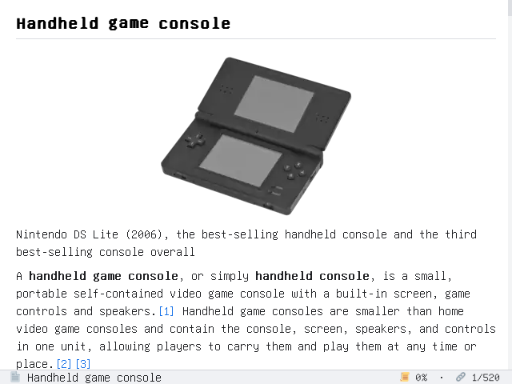

# Kiwix SDL

**Lightweight offline ZIM/Markdown reader for game consoles and desktop.**

Renders Wikipedia ZIM archives, Markdown, and HTML files via SDL2. Supports keyboard, mouse, and gamepad input. Designed for low-power ARM devices (TrimUI Smart Pro / PortMaster) but runs on any Linux/Windows desktop.



## Features

- **HTML** — Converts HTML to Markdown then render it
- **Article Tree** — Radix-tree browser for ZIM articles
- **Online Library** — Browse & download ZIM archives from [Kiwix Library](https://browse.library.kiwix.org/#lang=)
- **Emoji** — Embedded Twemoji SVGs (compressed zip), rendered via LunaSVG
- **Animated GIFs** — Frame-based animation in documents
- **SVG Images** — Inline SVG rasterization
- **Themes** — Light/Dark color schemes
- **Font Zoom** — Adjustable font size
- **Settings** — Persisted to `config.json`
- **Gamepad** — Full controller support for PortMaster devices
- **Touch/Mouse** — Click links, scroll wheels

## Quick Start

### Linux (native)

```bash
# Install dependencies
sudo apt install libsdl2-dev libsdl2-ttf-dev liblzma-dev libzstd-dev libicu-dev

# Build
make

# Run with a ZIM archive or markdown file
./kiwix-sdl wikipedia_ru_top_mini_2026-04.zim
./kiwix-sdl test.md
```

### Windows (cross-build)

```bash
make build-windows-amd64  # requires Docker
# Output in dist/windows/
```

### ARM64 / PortMaster (TrimUI Smart Pro)

```bash
make dist-arm64      # Docker cross-build
make deploy          # Push via ADB to device
make dist-portmaster # Package for PortMaster
```

## Controls

| Key | Action |
|---|---|
| Arrows / WASD | Scroll / Navigate links |
| Enter / Click | Open link |
| Backspace / Right-click | Go back |
| `T` | Toggle article tree |
| `M` | Main menu |
| `C` | Toggle theme |
| `+` / `-` | Zoom in/out |
| `Q` | Quit |

| Gamepad | Action |
|---|---|
| D-Pad / Left Stick | Scroll / Navigate |
| A | Open link |
| B | Back |
| X | Toggle tree |
| Y | Home |
| L1 / R1 | Page up/down |
| L2 / R2 | Zoom out/in |
| Select | Toggle theme |
| Guide | Quit |

## Project Architecture

```
cmd/kiwix-sdl/main.go    — Entry point, wires dependencies
internal/
  config/                — JSON config (theme, font, lang)
  document/              — Document model (Blocks/Inlines/Visitor)
  markdown/              — goldmark AST → Document
  html/                  — HTML → Markdown → Document + Math plugin
  zim/                   — libzim C++ bridge (cgo)
  renderer/              — SDL2 rendering (layout, draw, fonts, themes, images, emoji)
  ui/                    — App loop, input, loader, library browser, gamepad
  menu/                  — Virtual pages: file menu, help, settings
  navigation/            — History stack for back navigation
  storage/               — File I/O, ZIM opening, HTTP download
  trie/                  — Radix tree for ZIM article tree
  svg/                   — Embedded LunaSVG for SVG rasterization
portmaster/              — PortMaster distribution config
```

## Build Targets

| Target | Arch | Platform |
|---|---|---|
| `make build` | x86_64 | Linux native |
| `make build-linux-amd64` | x86_64 | Linux cross |
| `make build-linux-arm64` | aarch64 | Linux cross (TrimUI) |
| `make build-linux-armv8` | armv7l | Linux cross |
| `make build-windows-amd64` | x86_64 | Windows (Docker) |

## Dependencies

- **Go** 1.25+
- **SDL2**, **SDL2_ttf** (system or cross-compiled)
- **libzim** 9.7 (auto-downloaded or cross-built)
- **liblzma**, **libzstd**, **libicu** (for libzim)

Go modules: `go-sdl2`, `goldmark`, `html-to-markdown`, `golang.org/x/image` (webp), `golang.org/x/net`

## Configuration

`config.json` next to the binary:

```json
{
  "language": "en",
  "theme": "dark",
  "font_size": 16
}
```

Set via `KIWIX_FONT` env var for a custom TTF font path. `KIWIX_DEBUG=1` for debug logging.

## License

MIT
