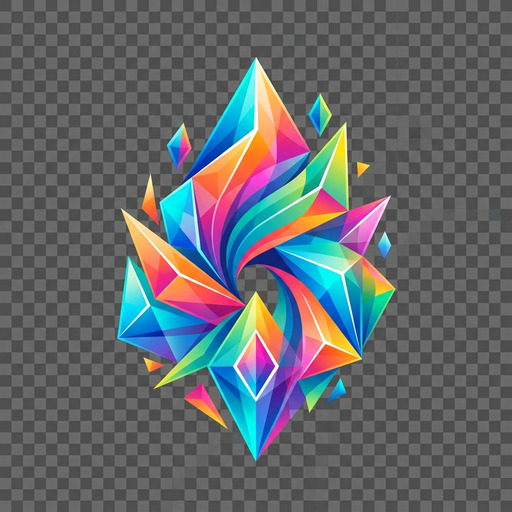

# Markdown Rendering Test Suite

This document contains a comprehensive set of markdown test cases to verify all supported blocks and inline formatting elements in `kiwix-sdl`.

## 1. Headings

# Heading 1
## Heading 2
### Heading 3
#### Heading 4
##### Heading 5
###### Heading 6

---

## 2. Inline Formatting

This is a standard paragraph to test basic inline formatting. It includes **bold text**, *italic text*, and ***bold and italic text***. We also have `inline code snippets` to verify monospace font rendering.

Here is a paragraph that tests punctuation spacing. Does it work right? Yes, it does. What about commas, like this one? Or brackets (like this)? 

---

## 3. Lists

### 3.1 Unordered Lists
- First item
- Second item with **bold** text
- Third item
  - Nested item A
  - Nested item B
    - Deeply nested item

### 3.2 Ordered Lists
1. Step one
2. Step two with *italic* text
3. Step three
   1. Sub-step 3.1
   2. Sub-step 3.2

---

## 4. Code Blocks

Plain text block:
```
This is a preformatted
multi-line text block.
```

Go syntax block:
```go
package main

import "fmt"

func main() {
    fmt.Println("Code blocks work!")
}
```

---

## 5. Links

### 5.1 Simple Links
- A short link to [Google](https://google.com).
- Two links in a row: [GitHub](https://github.com) and [Wikipedia](https://wikipedia.org).

### 5.2 Multi-line Wrappable Links
This is a test for a [very long and descriptive link that spans across multiple lines to ensure that the layout engine properly wraps it and the renderer correctly draws a multi-line selection highlight box behind the text when the user selects it](https://example.com). Did it wrap properly?

---

## 6. Images

### 6.1 Standalone Block Image
Below should be a single, horizontally-centered block image:


### 6.2 Inline Images
Here we have an image  embedded right in the middle of a sentence, followed by another image  to ensure they flow correctly with the text.

### 6.3 Consecutive Inline Images (No Text)
Two images in the same paragraph without text between them:
 

### 6.4 Broken Image (Fallback)
This image does not exist, so it should render the fallback alt text:


---

## 7. Blockquotes

> This is a blockquote.
> It should render as a normal paragraph in our MVP implementation,
> but it's good to verify it doesn't break the parser.
> 1. Step one
> 2. Step two with *italic* text
> 3. Step three
>    1. Sub-step 3.1
>    2. Sub-step 3.2

---
## 8. Emoji Rendering

### 8.1 Basic Emoji
😀😁😂🤣😃😄😅😆😇😈😉😊😋😌😍😎😏

### 8.2 Emoji in Sentences
This is **awesome** 🚀! I love kiwix-sdl ❤️. Click here ✅ to continue.
The weather is ☀️⛅🌧️❄️. Let's go ⛰️🏖️🌋!

### 8.3 Emoji Mixed with Bold/Italic
*Italic emoji test* 🔥 **Bold emoji test** ⭐ ***Both*** 💎

### 8.4 Flags
🇺🇸🇬🇧🇫🇷🇩🇪🇮🇹🇪🇸🇯🇵🇷🇺🇨🇳🇧🇷🇦🇺🇨🇦

### 8.5 ZWJ Sequences (Families)
- 👨‍👩‍👧‍👦 Family: man, woman, girl, boy
- 👨‍👩‍👧 Family: man, woman, girl
- 👩‍👩‍👧‍👧 Two women, two girls
- 👨‍👨‍👦‍👦 Two men, two boys

### 8.6 Skin Tones
👍👍🏻👍🏼👍🏽👍🏾👍🏿
👋👋🏻👋🏼👋🏽👋🏾👋🏿
🖐️🖐🏻🖐🏼🖐🏽🖐🏾🖐🏿

### 8.7 Keycaps
0️⃣1️⃣2️⃣3️⃣4️⃣5️⃣6️⃣7️⃣8️⃣9️⃣🔟
#️⃣*️⃣

### 8.8 Inline Emoji
To test word-wrapping with emoji: Lorem ipsum 😀 dolor sit amet 🔥 consectetur adipiscing elit 🚀 sed do eiusmod tempor ❤️ incididunt ut labore ⭐ et dolore magna aliqua 🎉

### 8.9 Emoji in Lists
- 😀 Smiley face
- 🚀 Rocket
- ❤️ Red heart
- ⭐ Star
  - 🎂 Birthday cake
  - 🎁 Gift
    - 💎 Gem stone

---
End of test suite.
